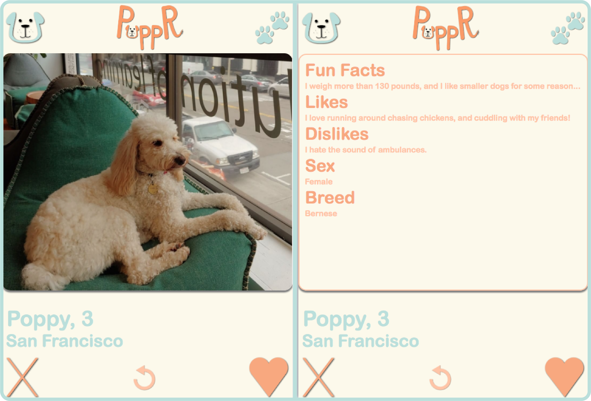

# PuppR ~ *Anything is pawssible*

# Introduction

## The Project
Every dog owner knows the struggle of moving to a new place and not knowing anyone else with a dog. However, dogs need to socialize too! This is why we created **PuppR**.

[**PuppR**](https://puppr.best/) is a dating site for dogs! Dog owners can create a profile for their pup, and start swiping through other dogs in their area. If they want to meet a dog, they can "like" their profile, and if that dog likes them back, it's a match! From there, the two users can decide to contact each other and organize a playdate for their dogs. If they don't like that dog, they can just "pass" it.

Other features include: editing the dog's profile, modifying the user settings, and a "previous" button to see the previous profile again.

## The Context
This project is our Portfolio Project, concluding our Foundations Year at Holberton School. We were able to choose who we wanted to work with and what we wanted to work on, as long as we present a working program at the end of the three weeks of development.

## The Team
We are three dog enthusiasts who are passionate about coding but also like to keep it fun!

* **Marc Cavigli** [@MarcCavigli](https://twitter.com/MarcCavigli) - Singer, Musician, song-writer and composer, but also a very talented Software Engineer.
* **Drew Maring** [@drewmaring](https://twitter.com/drewmaring) - Dog owner and great Software Engineer, formerly working at Docker as a Solutions Architect / Technical Account Manager.
* **Laura Roudge** [@LRoudge](https://twitter.com/LRoudge) - Former Dancer and Comedian, the "french touch" Software Engineer of the team.

Follow us on Twitter for more dog and tech related awesomeness!

## Blog posts
After the development phase, we each wrote a blog post to reflect on the PuppR journey.

* Marc's article: [PuppR: It’s Like Tinder For Dogs](https://medium.com/@mcavigli/puppr-its-like-tinder-for-dogs-c498bf4bdd9b)
* Drew's article: [PuppR: The social app for dog people](https://medium.com/@andrew.maring/puppr-the-social-app-for-dog-people-dcdb1c496f29)
* Laura's article: [PuppR: Learnings from building a dating site for dogs](https://medium.com/@laura.derohan/learnings-from-building-a-dating-site-for-dogs-70f4d649f2b3)

# Tutorial

## Take a tour of the deployed version at puppr.best
-> [**PuppR**](https://puppr.best/)

Here is a little preview of our main feature, the swiping through other dogs' profiles:

Here is a simple flow for the user experience on PuppR:

## Run PuppR with Vue-CLI
Installing the programs necessary to view this project is pretty simple!

We'll be using [`npm`](https://www.npmjs.com/get-npm) to install Vue and Vue-CLI. First clone this repo, then navigate to the root and [install Vue](https://vuejs.org/v2/guide/installation.html) by executing this command:
`puppr$ npm install vue`

Once that has finished, [install Vue-CLI](https://cli.vuejs.org/guide/installation.html) with this command:
`puppr$ npm install -g @vue/cli`

In case there are any missing dependencies, please execute `puppr$ npm install` to get them. If there's an error, it should return the specific command you need to enter.

Once this is all done you're ready to run **PuppR**! Still in the root of this directory, simply execute `puppr$ npm run serve` and give it a few seconds to get started. Once it's up, you can open your web browser and enter `localhost:8080`. This will allow you to try out **PuppR**!

When you are finished simply go back to your terminal and hit `ctrl + c` to quit the program.

## Known bugs
* Some transitions are not as fluid as expected, and due to API calls lag can be a bit off.
* Issue when viewing on mobile. Many of the assets become squished vertically.

# Architecture

## Overview
Our web app is a single-page app, coded mainly in Javascript. **PuppR** is front-end heavy, meaning that we focused our time and energy in developping a simple but easy to use and fun app. We designed most of the User Interface, using plain CSS and some native Vue transitions and animations. We also incorporated some BootstrapVue elements which offered a simple solution for some features like image uploading.

## Vue.js
For this project, we decided to focus on learning a new front-end framework. Following the advice of mentors and professionals, we chose to learn and use Vue.js.

Every different section of the app is a Vue component, and all the components can be found in the directory [src/components/](./src/components/). The main component "App" is defined in [App.vue](./src/App.vue), and is the entry point of the app.

All the components are linked together thanks to a VueRouter instance, defined in [index.js](./routes/index.js). Each component is linked to a route, which path is appended automatically at the end of our URL.

The [main.js](./src/main.js) file contains the instanciation of the Vue for the entire app, as well as the config options, database session and authentication session.

Another interesting point about Vue.js is that it allowed us to use a store, defined in [store.js](./src/store.js). This store is a front-end store that keep strack of the state of components and data throughout the app. This is were the data from our database requests is stored and updated before going back in the database. This store also allows to not pass props from each component to all its children components, and to access data from anywhere without having to use and event bus.

### List of components

These components make up what a user experiences when they check out **PuppR**. Each component contains the code for a specific page of the app. These components can be located in [src/components](./src/components).

| Component | Description |
|-----------|-------------|
| [Landing.vue](./src/components/Landing.vue) | The landing page a user sees when they navigate to **PuppR**. |
| [Login.vue](./src/components/Login.vue)   | The login page. There's a link to go to the Signup page if a user hasn't signed up. |
| [Matches.vue](./src/components/Matches.vue) | Page where users can see the other users they've matched with. A match occurs when two users have liked each other. |
| [Navbar.vue](./src/components/Navbar.vue) | The navigation bar that appears at the top of most every other component |
| [Settings.vue](./src/components/Settings.vue) | Users can change their email address, display name, city, and zip code on this page. |
| [Signup.vue](./src/components/Signup.vue) | Signup page for users who do not have an account. It asks for a valid email address and for them to make and confirm a password. |
| [Swiping.vue](./src/components/Swiping.vue) | The main page of **PuppR** where users can see another user's profile and choose whether to 'like' or 'pass.' |
| [UserProfile.vue](./src/components/UserProfile.vue) | Similar to Settings.vue, on this page the user can change their dog's information including likes, dislikes, and fun facts. |

## Firebase
We decided to go with Firebase for our backend/database as it provides all the functionality we need to develop this project such as authentication, database storage, and cloud storage. As a non-relational database, it made calling any required information simple.

Firebase was incredibly helpful while we were testing as it allowed us to look through each user's collection of information. This was helpful while we were implementing the logic for user likes and matches.

### Firestore
Since our app requires frequent and numerous database calls, Firestore provides a reliable and responsive solution to achieve a seamless experience. Practically all user information, such as display name, dog info, and even their like/match lists are kept in the Firestore. This lets us quickly populate each vue with relevant information.

For instance, when a user logs in they'll be taken to the main [Swiping](./src/components/Swiping.vue) component where another user's image, dog name, age, and location will be dispalyed. They can choose to 'like' or 'pass' the dog, which will immediately populate with another dog's information. Firebase's quick database calls populate this information and help keep this functionality snappy.

Images are kept in the Firestore as a link to where they're held in cloud storage. 
### Authentication
As our app connects people and their dogs, authentication is a necessity. Firebase provides a straightforward and easy-to-implement solution so we can focus on designing an accessible app. Users simply sign up with an existing email address and a password of their choice. Firebase Authentication does the heavy lifting to make sure users are authentic.
### Cloud Firestore
The obvious choice for storing users' dog photos. It provides straightforward implementation for users to upload their photo and a relatively quick way to call and display these images for users to sift through.

# Acknowledgments

* Holberton School staff - For the help, advice and resources they provided us with during this project and during all our curriculum.

* Cohort 8 and all Holberton students - For your friendship, invaluable support, and insight not only for this project, but over the last year.

* Our dogs (or friends' dogs) - For the inspiration, courage and love they brought us when we were working hard and tired.

* Romain Bonhomme - For his incredible Vue.js knowledge and overall front-end good practices.

* Valentin Roudge - For his help and advice in Node.js and architecture best practices.

* YOU - For reading this documentation and testing out **PuppR**. We hope you enjoyed the ride!

# Related projects

* [AirBnB Clone](https://github.com/lroudge/AirBnB_clone_v4): a simple web app made in Python, Flask, and JQuery.

* [Simple Shell](https://github.com/scurry222/simple_shell): a command line interpreter that replicates the sh program.

# License

MIT License

